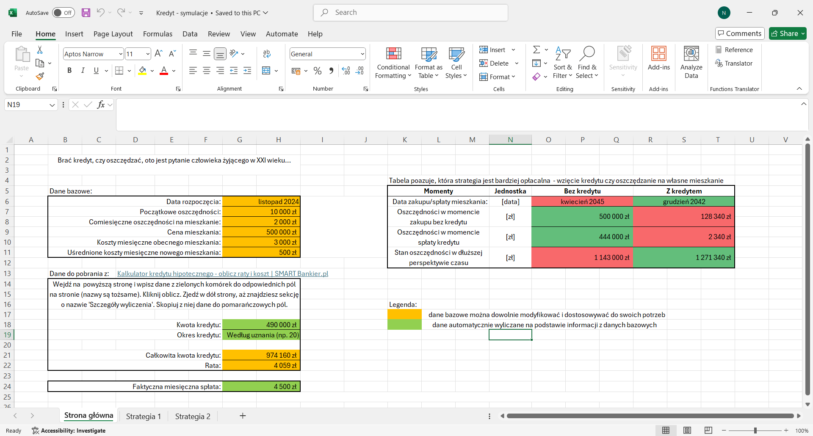
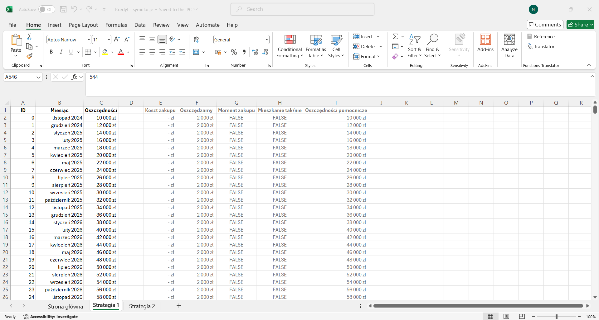
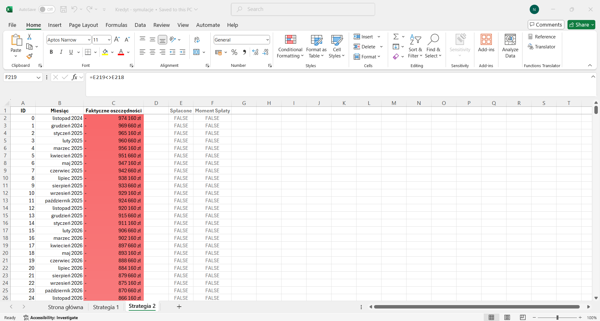

# Streszczenie

Sytuacja mieszkaniowa w Polsce nie napawa optymizjem. Rosnące ceny mieszkań, pędząca inflacja i niestabilna sytuacja na rynku pracy potrafią zakołysać emocjami nawet najbardziej stoickiego trzydziestolatka, który był pewien, że w życiu już nic go nie zdziwi. Jednak teraz zaczyna się zastanawiać, czy będzie go stać na mieszkanie. A jak tak, to na jakich warunkach? 

Odpowiedź będzie mógł znaleźć poniżej. Przygotowałam plik Excel* zawierający 2 strategie związane z zakupem mieszkania (za kredyt lub nie). Znaleźć tu można przybliżone obliczenia i poorównania obu strategii. 

*Samo narzędzie nie jest w żaden sposób poradą finansową. Jest to proste symulacja do testowania na swoich danych możliwych rezultatów. Zapraszam do sprawdzenia!

# Portfolio
Zawarty w portfolio plik Excel zawiera 2 strategie dotyczące kupna mieszkania (za kredyt lub nie) oraz zawiera ich porównanie.

- Arkusz 1 - Strona Główna: zawiera podstawowe dane wejściowe do obliczeń oraz podsumowanie wyników obu strategii.

- Arkusz 2 - Strategia 1: polega na oszczędzaniu pieniędzy przez wiele lat, a po tym czasie zakupieniu mieszkania.

- Arkusz 3 - Strategia 2: polega na wzięciu kredytu na x lat, kupieniu mieszkania i spłacie kredytu.

## Wnioski:

- Strategia 1: Dłuższy czas oczekiwania na zakup mieszkania oraz wyższe koszty bieżącego wynajmu. Jednak po zakupie mieszkania nie trzeba przejmować się spłatą odsetek.

- Strategia 2: Szybszy zakup mieszkania przez co odpadają wysokie koszty wynajmu, jednak pojawiają się koszty w postaci odsetek. Osoba decydująca się na tą strategię może od razu cieszyć się własnym mieszkaniem.

Obie strategie mają swoje plusy i minusy, najważniejsze jest wybranie najlepszej strategii pod swoje parametry. Interaktywne podsumowanie pomaga w czasie rzeczywistym śledzić zmiany, które użytkownik wprowadza do obu strategii.
